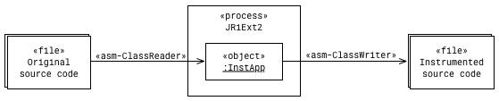
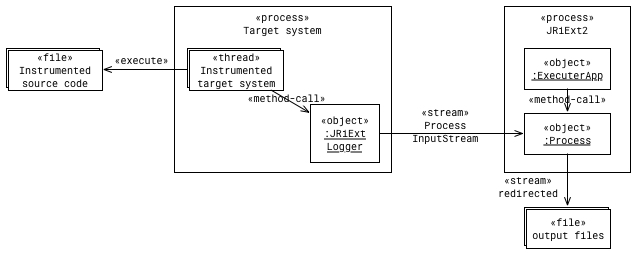
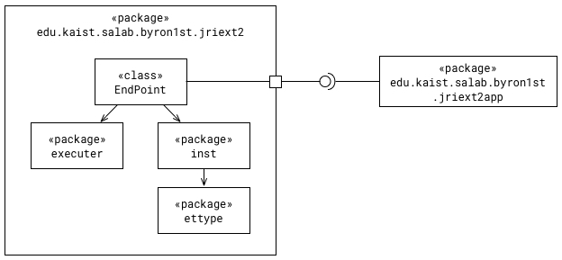

# JRiExt2
**J**ava **R**untime **i**nformation **Ext**ractor 2 (JRiExt2)

This is the next version of the original [JRiExt](https://github.com/byron1st/jriext).

This program is built upon:
* [ASM 5](http://asm.ow2.org)
* [Apache Commons Lang 3](https://commons.apache.org/lang/)
* [Apache Commons CLI](https://commons.apache.org/proper/commons-cli/)
* [org.json](https://github.com/byron1st/jriext2)

## Purpose
이 프로그램은 <u>특정 메소드</u>가 실행 되었을 때, 다음 정보들을 로깅하기 위해 제작되었습니다.
 * 실행된 메소드의 파라미터 값
 * 실행된 메소드를 갖고 있는 클래스의 필드 값
 * 특정 static 메소드를 실행하여 얻을 수 있는 값 (e.g. `Thread.currentThread().hashCode()`)
 
## Architecture
### Runtime View Architecture
JRiExt2는 크게 2개의 실행 구조를 갖습니다. 첫째로는 대상 시스템의 바이트코드를 수정하는 Instrumentation 실행입니다. 두번째는 바이트코드가 수정된 대상 시스템의 실행입니다. 각각에 대한 구조는 다음과 같습니다.

바이트코드 수정은 [ASM 5 라이브러리](http://asm.ow2.org)를 사용합니다. ASM 5의 `ClassReader`를 이용해서 기존의 소스코드를 로드해 온 후 싱글톤으로 정의된 `InstApp` 객체가 필요한 바이트코드를 삽입한 후 ASM 5의 `ClassWriter`를 이용하여 변경된 소스코드를 출력합니다.

대상 시스템의 실행은 역시 싱글톤으로 정의된 `ExecuterApp` 객체가 담당하는데, 이 객체가 생성한 `Process` 객체를 통해 실행하게 됩니다. 대상 시스템은 수정된 소스코드를 실행하는데, 이 때 수정된 소스코드에는 `JRiExtLogger` 클래스의 static 메소드인 `recordExecutionTrace`를 호출하도록 되어 있습니다. 그리고 이 메소드는 같은 클래스의 static 메소드인 `send`를 호출하는데, 이 메소드에 `JRiExt2`에 로깅 메세지를 보낼 코드가 들어오게 됩니다. 현재는 `System.out.print` 호출하여 `JRiExt2` 프로세스의 `ProcessInputStream`으로 넘겨주게 되어 있습니다. 향후 DB 등으로 바로 저장해야 할 수도 있기 때문에 `setUpConnection` 등의 메소드들도 정의되어 있지만, 내부는 아직 구현되지 않았습니다.

### Code View Architecture
메인 패키지는 `edu.kaist.salab.byron1st.jriext2` 패키지입니다. 이 패키지는 크게 3개의 서브 패키지로 구성이 되어 있는데, 각각 `ettype`, `executer`, `inst` 패키지입니다.

`inst`와 `executer` 패키지는 각각 대상의 바이트코드를 수정하고, 바이트코드가 수정된 코드를 실행하는 역할을 수행하며, 두 패키지 사이에 필요한 공통 상수들은 `Symbols` 인터페이스에 정의되어 있습니다. `Symbols`에 정의된 상수들 외에는 두 패키지 사이의 의존관계는 없습니다.

`ettype`은 **E**xecution **T**race **Type**의 정의를 저장하는 데이터 구조로 `inst` 패키지에서 어떤 메소드의 어떤 값을 기록해야 하는지 정보를 알기 위해 사용합니다. 즉, `inst` 패키지의 `InstApp` 클래스에서 `instrument` 메소드는 `ettype`의 `ArrayList`를 입력값으로 받습니다. 그리고 이 `ettype` 객체들을 순회하며 요구되는 대상 메소드에 로깅을 위한 Bytecode를 기록합니다. `executer` 패키지는 `ettype` 과는 의존관계를 갖지 않습니다.

`jriext2app` 패키지는 `jriext2` 라이브러리를 이용한 앱을 일종의 예제로서 만든 것입니다. `jriext2app`과 같이 `jriext2` 패키지를 참조하는 외부 앱들은 `Endpoint` 클래스의 static 함수들을 통해 바이트코드 수정(instrument), 대상 시스템 실행 등의 기능을 실행합니다.

#### `inst` 패키지

`inst` 패키지는 싱글톤으로 정의된 `InstApp`에 핵심 기능인 `instrument` 메소드가 정의되어 있습니다. 이 메소드는 `Endpoint` 클래스를 통해 외부에서 접근할 수 있도록 되어 있습니다. `InstApp`은 ASM 5 라이브러리의 `ClassReaer`, `ClassWriter`를 이용해서 소스코드를 읽고 씁니다. 또한 ASM 5의 `ClassVisitor`, `AdapterVisitor`를 상속받아 구현된 `JRiExt2ClassVisitor`, `JRiExt2MethodVisitor`를 이용해서 소스코드의 바이트코드를 수정합니다. 여기서, `ettype`을 해석해서 관련된 바이트코드를 삽입하는 코드가 구현된 곳은 `JRiExt2MethodVisitor` 입니다.

`inst` 패키지에서 `InstApp`과 `JRiExt2MethodVisitor`는 `ettype` 패키지에 대한 의존성을 갖고 있습니다.

#### `executer` 패키지

`executer` 패키지에는 `ExecuterApp`이 싱글톤으로 정의되어 있습니다. 그리고 `Endpoint`에서 접근할 수 있는 3개의 메소드를 갖고 있는데, 각각 `execute`, `stop`, `setProcessObserver` 입니다. `execute`는 대상 시스템을 실행하는데, 이때 필요한 바이트코드가 수정된 클래스들의 경로는 `Symbols` 클래스를 통해 공유되고 있습니다. 이 메소드는 실행된 프로세스를 식별할 수 있도록 고유한 `processKey` 값을 반환합니다. `stop`은 `processKey` 값을 이용하여 실행 중인 프로세스를 종료시킬 수 있습니다. 그리고 `setProcessObserver`는 Observer 패턴의 인터페이스인 `ProcessStatusObserver`의 구현체를 지정할 수 있습니다. `ProcessStatusObserver`를 통해 감지 할 수 있는 건 프로세스의 시작과 종료입니다. 시작과 종료는 `Symbols`에 `ProcessStatus`라는 enum(`START`, `TERMINATED`)으로 정의되어 있습니다.

#### `ettype` 패키지

`ETType` 클래스는 여러 `ETTAttribute`를 갖습니다. `ETTAttribute`는 기록해야 할 값이 무엇인지를 정의합니다. 각 `ETTAttribute`는 4가지 종류 중 하나입니다: `ETTAttributeMethod`, `ETTAttributeField`, `ETTAttributeReturn`, 그리고 `ETTAttributeParameter`. 각각에 대한 정의는 다음과 같습니다. 모든 종류는 마지막에 `String`을 반환하도록 해야 의도한대로 기록할 수 있습니다.

* `ETTAttributeMethod`: 대상 메소드가 실행될 때, 메소드를 호출하여 기록하는 것을 의미합니다. 예를 들면, `Thread.currentThread().hashCode` 같은 것입니다.
* `ETTAttributeField`: 대상 메소드가 실행될 때, 대상 메소드를 소유하고 있는 객체의 필드값을 기록합니다. 해당 필드의 null 체크는 자동으로 하니 걱정하지 않아도 됩니다.
* `ETTAttributeReturn`: 대상 메소드가 실행될 때, 대상 메소드의 반환값을 기록합니다.
* `ETTAttributeParameter`: 대상 메소드가 실행될 때, 대상 메소드의 파라미터들 중 하나를 기록합니다. 어떤 파라미터를 기록할지도 정해주어야 합니다.

각 `ETTAttribute`들은 한번에 `String`을 반환하지 않을 수도 있기 때문에, 이를 위해 `nextMethod`를 필드로 갖습니다. 이 필드는 `ETTAttributeMethod` 타입으로, LinkedList 형태로 여러개가 연결됩니다. 이런식으로 최종적으로는 `String` 변수를 반환하는 메소드를 지정해주어야 의도한대로 기록할 수 있습니다. 그렇지 않으면, 예를 들어, `Thread.currentThread()`에서 멈추면, 출력값은 `Thread@123512` 이런식이 될 것입니다.

#### `java.util.JRiExtLogger`

`JRiExtLogger`는 마치 `java`의 기본 클래스인 것처럼 보여야 하기 때문에 `java.util` 패키지로 정의했습니다. 이유는 `ExecuterApp`이 대상 시스템을 실행할 때, `Xbootclasspath/p` 커맨드를 이용하여 실행하는데, 이 때 `java` 패키지 내의 기본 클래스들만 `rt.jar`를 로드하기 전에 미리 로드합니다. `JRiExtLogger`는 바이트코드가 수정된 기본 클래스들과 함께 초기에 로드가 되어야만 클래스를 찾을 수 없다는 예외를 피할 수 있습니다. 그래서 마치 `java.util` 패키지의 클래스 인것처럼 보이기 위해 해당 패키지로 정의하였습니다.

## JRiExt2App
`edu.kaist.salab.byron1st.jriext2app` 패키지에는 CLI를 제공하는 예제 어플리케이션이 제작되어 있습니다. 이는 나중에 [JRiExt2ManagerApp](https://github.com/byron1st/JRiExt2ManagerApp)에서 이용하기 위해서 제작된 어플리케이션입니다. 이 어플리케이션은 `System.in`으로 입력된 JSON 형태의 커맨드를 해석하여 `Endpoint`를 통해 적절한 기능을 수행합니다. 그리고 `ProcessStatusObserver`를 이용하여 앱의 종료를 감지한 후 이를 `System.out`으로 전달합니다. 모든 커맨드, 메세지는 JSON 형태로 보내고 받습니다. 또한, JSON 형태로 전달된 Execution Trace Type을 해석하여 `ettype`의 `ArrayList`로 변환합니다.

## 주의할 점
* 현재 따로 빌드해서 패키지 하지 않습니다. Gradle의 installDist를 이용해서 실행 파일을 생성하여 사용합니다.
* `java.util.JRiExtLogger`는 컴파일하여 만들어진 class 파일 경로를 사용하고, 이 경로는 `Symbols` 클래스에 상수로 정의되어 있으나, 이 경로가 현재 제 PC에 맞춰진 절대경로를 쓰고 있습니다.
* `nextMethod`를 이용해서 메소드 체인을 만들 때, 해당 체인이 valid한 체인인지 여부는 검사하지 않습니다. valid하기 위해서는 `ETTAttributeMethod`의 반환 타입과 `nextMethod`의 클래스가 정확히 일치하거나, `nextMethod`의 클래스가 반환 타입의 상위 클래스여야 합니다. 예를 들어, Thread가 `ETTAttributeMethod`의 반환 타입이고, Object가 `nextMethod`의 클래스일 경우 동작합니다. invalid할 경우 따로 경고 메세지나 예외를 던지진 않습니다. 단지 생성된 바이트코드 파일이 디컴파일되지 않고, 그냥 실행하면 런타임 에러가 납니다.